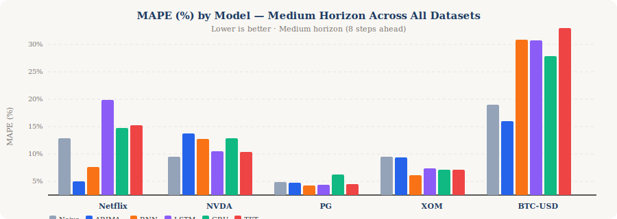

# A Multi-Domain Comparison with Pytorch Forecasting: RNN, LSTM, GRU & TFT

---

## Authors

| Name | GitHub |
|------|--------|
| *Nathan Brewer* | [`Gratedanate`](https://github.com/Gratedanate) |
| *Cade Haskins* | [`Cade26-code`](https://github.com/Cade26-code) |
| *Pratham Reddy* | [`PrathamReddy55`](https://github.com/PrathamReddy55) |
| *Morgan Wait* | [`morganwait`](https://github.com/morganwait) |

---

## Quick Links

| Resource | Link |
|----------|------|
| 📓 Notebook (Google Colab) | [`Project Code`](https://colab.research.google.com/drive/1HjXrNkBwUZ1UVd5D6W5q9e3ZMZ2iHhJk?usp=sharing) |
| 🌐 Interactive Web App | [`Stochastic Modeling with Pytorch Forecasting`](https://tp-2-pytorch-forecasting-team4.vercel.app/results) |
| 📊 Full Results CSV | [`docs/full_results.csv`](docs/full_results.csv) |

---

## Project Scope

> *Across time-series with fundamentally different structures — a smooth subscription growth curve (Netflix) and a volatile cross-sectional stock portfolio (NVIDIA, P&G, Exxon, Bitcoin) — how do deep learning sequence models (RNN, LSTM, GRU) and attention-based models (TFT) compare to classical statistical baselines (ARIMA, Naïve) in multi-step forecasting accuracy, and what does this reveal about model selection strategy for business forecasting?*

This project benchmarks **six forecasting models** across **five datasets** and **three forecast horizons** (90 total experiments) to produce data-driven, evidence-backed guidance for model selection in business and financial forecasting contexts.

---

## Project Details

### Models Evaluated

| Model | Year | Type | Key Property |
|-------|------|------|-------------|
| **Naïve** | — | Baseline | Repeats last observed value |
| **ARIMA** | 1970 | Classical Statistical | Linear, interpretable, best for stationary data |
| **RNN** | 1986 | Deep Learning | Sequential; suffers vanishing gradient |
| **LSTM** | 1997 | Deep Learning | Solves vanishing gradient via cell state + 3 gates |
| **GRU** | 2014 | Deep Learning | Simplified LSTM with 2 gates; fewer parameters |
| **TFT** | 2021 | Transformer | Attention-based; multi-horizon; quantile outputs |

### Datasets

| Dataset | Type | Period | Frequency | Regime |
|---------|------|--------|-----------|--------|
| **Netflix Subscribers** | Subscription growth | 2013–2024 | Quarterly | Smooth, trend-dominant |
| **NVDA (NVIDIA)** | Equity | 2015–2025 | Weekly | High-growth, momentum-driven |
| **PG (Procter & Gamble)** | Equity | 2015–2025 | Weekly | Low volatility, defensive |
| **XOM (Exxon)** | Equity | 2015–2025 | Weekly | Macro-driven, cyclical |
| **BTC-USD (Bitcoin)** | Cryptocurrency | 2015–2025 | Weekly | Extreme volatility |

### Evaluation Metrics

- **MAE** (Mean Absolute Error) — average error in original units
- **RMSE** (Root Mean Squared Error) — penalizes large errors more heavily
- **MAPE** (Mean Absolute Percentage Error) — error as % of actual; primary cross-dataset metric

### Forecast Horizons

- **Short:** 4 steps ahead
- **Medium:** 8 steps ahead
- **Long:** 12 steps ahead

---

## Model History

Finance is one of the most dynamic and consequential sectors in the global economy, serving as a barometer of economic health and a primary vehicle through which investors allocate capital, manage risk, and generate returns (Boubakari & Jin, 2010). At the heart of sound financial decision-making lies the ability to forecast: to anticipate how asset prices, subscriber bases, and revenue streams will behave over time. When forecasts are accurate, firms optimize inventory, hedge exposure, and allocate resources efficiently. When they are not, the costs compound across every layer of the organization. Despite decades of methodological advancement, financial time series forecasting remains one of the most challenging problems in quantitative analysis, owing to the influence of social, political, and macroeconomic forces that interact in ways no single model fully captures (Challu et al., 2022).

The history of time series forecasting is one of continuous attempts to close that gap. The AutoRegressive Integrated Moving Average (ARIMA) framework, formalized by Box and Jenkins (1970), established the dominant paradigm for several decades. Interpretable and well-suited to stationary data with linear trends, ARIMA became the standard tool of applied econometrics. Its limitations, however, are equally well-documented: the model assumes linearity, struggles with non-stationary and high-volatility data, and offers little capacity to learn complex, hierarchical patterns from large datasets. These constraints motivated the turn toward neural architectures.

The introduction of Recurrent Neural Networks (Rumelhart et al., 1985) marked the first serious attempt to model sequential dependencies through learned representations rather than hand-crafted statistical assumptions. Yet simple RNNs carried a fundamental flaw, the vanishing gradient problem, which caused them to lose information across long sequences. This flaw rendered them unreliable for the kind of extended temporal dependencies that financial data demand. Long Short-Term Memory networks (Hochreiter & Schmidhuber, 1997) addressed this directly by introducing a cell state and three gating mechanisms: input, forget, and output. These introductions enabled the selective retention of long-range information at the cost of greater computational complexity. The Gated Recurrent Unit (Cho et al., 2014) followed as a streamlined alternative, consolidating the LSTM's gate structure into an update gate and a reset gate, reducing parameter count while preserving much of the memory capacity. Empirical evidence has increasingly favored the GRU in financial contexts; a comprehensive cross-continental study of stock market indices and currency exchange rates found that the GRU consistently outperformed both the RNN and LSTM baselines across univariate and multivariate forecasting tasks (Challu et al., 2022).

The most recent turning point came with the Transformer architecture (Vaswani et al., 2017), which allowed a model to simultaneously assess the relevance of every point in a sequence relative to every other, regardless of temporal distance. Building directly on this foundation, the Temporal Fusion Transformer (Lim et al., 2021) adapted multi-head attention specifically for multi-horizon time series forecasting, incorporating variable selection networks, gated residual connections, and interpretable attention weights that reveal which historical timesteps most influenced a given prediction. Critically, while recent Time Series Foundation Models pre-trained on generic datasets have shown promise, the literature cautions that off-the-shelf models underperform strong benchmarks unless pre-trained on domain-specific financial data — underscoring the continued importance of deliberate model selection over passive adoption of the latest architecture (Ansari et al., 2024).

This project contributes to that ongoing conversation by conducting a structured, multi-domain benchmark comparison across six forecasting methods: Naïve, ARIMA, RNN, LSTM, GRU, and TFT. The models will be evaluated against two structurally distinct datasets: Netflix quarterly subscriber counts, representing a smooth and trend-dominant growth series, and a cross-sectional portfolio of four assets: NVIDIA, Procter & Gamble, Exxon, and Bitcoin. These assets were selected to represent high-growth, low-volatility, macro-driven, and high-volatility market regimes respectively. This cross-sectional portfolio selects representative assets from multiple, distinct economic sectors (Tech, Consumer Staples, Energy, and Crypto), and risks at the same point in time. By testing all models simultaneously across these varied domains and at short, medium, and long forecast horizons, this study aims to produce findings that are robust across market conditions rather than artifacts of a single asset class. The central research question guiding this analysis is: *across time-series with fundamentally different structures, how do deep learning sequence models and attention-based architectures compare to classical statistical baselines in multi-step forecasting accuracy, and what does this reveal about model selection strategy for business forecasting?*

---

## Model Definitions: ARIMA, RNN, LSTM, GRU, and TFT

**ARIMA (AutoRegressive Integrated Moving Average)**: This is a classical statistical model suitable for stationary data and assumes linear trends/seasonality. It is highly interpretable and requires less data but struggles with complex, non-linear patterns and long-term dependencies. (Box and Jenkins, 1970). We will use ARIMA as the Naïve Statistical Baseline.

**RNN (Recurrent Neural Network)**: The foundational sequence model. They use a simple recurrent connection where the hidden state at each time step is a function of the current input and the previous hidden state. Their primary limitation is the inability to effectively capture long-range dependencies because gradients can vanish or explode over many time steps. (Rumelhart et al., 1985).

**LSTM (Long Short-Term Memory)**: An advancement over RNNs designed to solve the vanishing gradient problem. LSTMs introduce a "cell state" and three gating mechanisms (input, forget, and output gates) to selectively remember or forget information over extended sequences. This allows them to model long-term dependencies effectively, but at the cost of higher computational complexity and more parameters. (Hochreiter & Schmidhuber, 1997).

**GRU (Gated Recurrent Unit)**: A simplification of the LSTM, offering a balance between performance and efficiency. GRUs combine the forget and input gates into a single "update gate" and merge the cell state and hidden state. They have fewer parameters and are faster to train than LSTMs while often achieving comparable performance on various tasks. (Cho et al., 2014)

**TFT (Temporal Fusion Transformer)**: A more recent, state-of-the-art architecture based on the Transformer model and designed specifically for multi-horizon time series forecasting. Unlike RNN, LSTM, and GRU which process data sequentially, the TFT uses a global attention mechanism, allowing it to process data in parallel and scale efficiently to large datasets. It also provides interpretability features like variable selection. (Lim et al., 2021)

---

## Pros and Cons: Model Comparisons

| Parameter | RNN | GRU | LSTM | Temporal Fusion Transformer (TFT) |
| :--- | :--- | :--- | :--- | :--- |
| **Long-Term Memory** | Poor; prone to vanishing gradients. | Good; uses gates to manage information flow. | Excellent; uses separate cell state and multiple gates. | Excellent; uses attention mechanisms to link relevant past/future data points. |
| **Complexity** | Simple, few parameters. | Less complex than LSTM, more than RNN. | More complex than GRU/RNN. | High; incorporates components like variable selection and attention. |
| **Training Speed** | Fast, but less accurate on complex data. | Faster than LSTMs. | Slower than GRUs due to higher complexity. | Faster than LSTMs/GRUs on large datasets due to parallelization. |
| **Parallelization** | Limited; strictly sequential processing. | Limited; relies on sequential processing. | Limited; relies on sequential processing. | High; attention mechanism allows parallel processing. |

---

## Why This Matters for Business

Forecasting is one of the most consequential tasks in modern business. Accurate forecasts help firms optimize inventory, hedge financial exposure, plan infrastructure, and allocate capital efficiently. When forecasts fail, those costs compound across every downstream decision.

Despite decades of innovation — from ARIMA in the 1970s to Transformer-based models in 2021 — no single model has proven universally superior. Practitioners frequently default to the most architecturally complex model available, assuming novelty equals accuracy. This study tests that assumption empirically across structurally different real-world datasets.

The business stakes are real: a model with 30% MAPE at a long horizon is not just academically imprecise — it is operationally dangerous if used to inform staffing, pricing, or capital allocation decisions without appropriate uncertainty disclosure.

---

## Results Summary

#### Full MAPE Table (%) — All Models × All Datasets × All Horizons

| Dataset | Horizon | Naïve | ARIMA | RNN | LSTM | GRU | TFT | **Winner** |
|---------|---------|-------|-------|-----|------|-----|-----|-----------|
| Netflix | Short | 9.42 | 4.44 | 6.22 | **3.65** | 4.33 | 10.74 | LSTM |
| Netflix | Medium | 10.32 | **2.52** | 5.13 | 17.30 | 12.22 | 12.71 | ARIMA |
| Netflix | Long | 11.54 | **7.48** | 34.35 | 32.63 | 31.94 | 15.25 | ARIMA |
| NVDA | Short | 5.47 | 5.94 | 2.53 | 1.79 | 0.95 | **0.80** | TFT |
| NVDA | Medium | 6.95 | 11.29 | 10.24 | 7.96 | 10.42 | **7.91** | TFT |
| NVDA | Long | 3.05 | 4.89 | 15.73 | 16.66 | 13.23 | **12.74** | TFT |
| PG | Short | 2.81 | 4.11 | 5.92 | **1.16** | 3.14 | 1.65 | LSTM |
| PG | Medium | 2.40 | 2.29 | **1.73** | 1.89 | 3.68 | 2.06 | RNN |
| PG | Long | 1.74 | 2.02 | 2.19 | 5.45 | 2.64 | **1.71** | TFT |
| XOM | Short | 5.49 | 5.56 | 8.73 | 4.51 | 6.97 | **2.51** | TFT |
| XOM | Medium | 7.00 | 6.91 | **3.65** | 4.81 | 4.60 | 4.62 | RNN |
| XOM | Long | 7.24 | 7.24 | **3.72** | 4.06 | 6.13 | 4.32 | RNN |
| BTC-USD | Short | 6.49 | 10.22 | 5.40 | **3.67** | 4.10 | 17.37 | LSTM |
| BTC-USD | Medium | 16.52 | **13.51** | 28.46 | 28.33 | 25.31 | 30.49 | ARIMA |
| BTC-USD | Long | 27.11 | **26.59** | 31.54 | 29.84 | 33.57 | 42.92 | ARIMA |

### Key Findings

1. **No single model dominates universally.** ARIMA remains highly competitive on smooth, low-volatility series (Netflix subscriber growth), while deep learning models — especially LSTM and GRU — show advantages on volatile series at short horizons. Notably, ARIMA outperformed all deep learning models on BTC at medium and long horizons, challenging the assumption that neural architectures are superior on high-volatility data.

2. **Horizon matters more than model choice.** Across all methods, MAPE degrades sharply beyond 8 steps. This suggests that for long-horizon business planning, *ensemble strategies* or interval forecasts (e.g., TFT quantiles) are preferable to any single point estimate.

3. **TFT's advantages are most evident on stable, low-volatility series.** TFT achieved its best results on PG (long: 1.71% MAPE) and XOM (short: 2.51% MAPE), but was the worst-performing model on BTC across all horizons (short: 17.37%, long: 42.92%). The added architectural complexity does not reliably translate to accuracy gains on high-volatility or short univariate series.

4. **RNN underperforms consistently.** Vanilla RNN is dominated by both LSTM and GRU across all experiments, confirming that gated architectures effectively solve the vanishing gradient limitation. RNN should generally be avoided in production.

5. **Data structure is the primary model selection criterion.** Practitioners should assess series *volatility*, *length*, and *available covariates* before selecting a model — not default to deep learning due to novelty.

### Business Implications

| Business Context | Recommended Model | Evidence |
|-----------------|-------------------|---------|
| Subscription / SaaS growth | ARIMA | Netflix-medium: 2.52% MAPE — best result in the study |
| High-volatility assets, short horizon | LSTM or GRU | BTC-short LSTM: 3.67%; NVDA-short GRU: 0.95% |
| High-volatility assets, medium–long horizon | ARIMA | ARIMA outperformed all DL models on BTC beyond 4 steps |
| Low-volatility equities | TFT or LSTM | TFT best on XOM-short (2.51%) and PG-long (1.71%) |
| Regulatory / interpretability required | ARIMA | Explicit, auditable coefficients |
| Real-time, high-frequency | GRU | Fewer parameters; fastest inference |

---

## What's Next? Future Developments and Concerns

The results of this benchmark point toward several natural extensions, both within this project and across the broader forecasting literature.

### Foundation Models for Time Series
The most significant near-term development in forecasting is the emergence of large-scale pretrained models — analogous to GPT in NLP — that can forecast zero-shot without task-specific training. Models such as TimesFM (Das et al., 2024), Moirai (Woo et al., 2024), and Chronos (Ansari et al., 2024) are trained on billions of time series observations and can be applied directly to new datasets. Our benchmark provides a clean set of baselines to test whether these foundation models improve on the ARIMA, GRU, and TFT results reported here, particularly on the high-volatility BTC series where all models struggled beyond 8 steps. As Ansari et al. (2024) caution, however, off-the-shelf foundation models tend to underperform strong task-specific baselines unless fine-tuned on domain-relevant data — a finding our results are broadly consistent with.

### Ensemble and Regime-Switching Methods
Because no single model dominated across all datasets and horizons — ARIMA outperformed deep learning on BTC at medium and long horizons, while GRU and LSTM led on short-horizon equity forecasting — a logical next step is to combine models rather than select one. Ensemble methods that blend predictions from multiple architectures have consistently outperformed individual models in forecasting competitions such as the M4 and M5 (Makridakis et al., 2020). A regime-switching layer that detects volatility state and routes predictions accordingly (e.g., ARIMA during stable periods, GRU during high-variance regimes) could address the horizon-dependent reversals observed in this study.

### LLM-Augmented Forecasting
An emerging line of research explores whether large language models (LLMs) can contribute to time series forecasting by encoding contextual knowledge — news sentiment, earnings call transcripts, central bank communications — that purely numerical models cannot access (Jin et al., 2024). While this approach remains experimental and its empirical advantages over strong statistical baselines are not yet firmly established, it represents a meaningful direction for financial forecasting specifically, where narrative context frequently precedes price movement.

---

## Responsible AI Considerations

Deploying forecasting models in financial and business contexts carries responsibilities that extend beyond predictive accuracy.

### Forecast Uncertainty and Transparent Communication
Across all models and datasets, MAPE exceeded 25% at long horizons for volatile assets, and no model consistently outperformed a naïve baseline in all conditions. Presenting model outputs as confident predictions — particularly through polished dashboards or automated systems — risks misleading decision-makers about the reliability of the underlying forecasts. Responsible deployment requires that uncertainty be communicated explicitly alongside point estimates, for instance through prediction intervals, confidence bands, or plain-language caveats (Dietvorst et al., 2015). The distinction between a model's in-sample fit and its out-of-sample generalization is especially important in financial contexts, where overfitting to historical regimes is a persistent risk.

### Opacity and Accountability in Black-Box Models
ARIMA's coefficients are directly interpretable and auditable; a regulator or stakeholder can inspect exactly how past values are weighted in producing a forecast. GRU, LSTM, and TFT offer no equivalent transparency. As these models move closer to production use in regulated industries — financial advising, credit allocation, utility planning — the inability to explain a specific prediction becomes a compliance risk as well as an ethical one. The EU AI Act (2024) classifies AI systems used in credit scoring and financial decision-making as high-risk, requiring documentation, human oversight, and explainability standards that black-box neural architectures do not inherently satisfy. Practitioners adopting deep learning for forecasting should pair model outputs with post-hoc explanation tools such as SHAP or integrated gradients where deployment context demands accountability.

### Automation Risk and Human Oversight
Integrating these models into automated decision pipelines — algorithmic trading, dynamic resource allocation, or automated reporting — introduces the risk that errors propagate silently and at scale before any human review occurs. This concern is amplified for the deep learning models evaluated here, where there is no mechanism to flag when a prediction has been generated under conditions meaningfully different from the training distribution. Maintaining meaningful human oversight over model-driven decisions, particularly at longer and more uncertain forecast horizons, is a practical safeguard consistent with broader responsible AI frameworks (Floridi et al., 2019).

---

## References

1. Ansari, A. F., Stella, L., Turkmen, C., Zhang, X., Mercado, P., Shen, H., Shchur, O., Rangapuram, S. S., Arango, S. P., Kapoor, S., Zschiegner, J., Maddix, D. C., Mahoney, M. W., Torkkola, K., Gordon Wilson, A., Bohlke-Schneider, M., & Wang, Y. (2024). Chronos: Learning the language of time series. *arXiv*. https://arxiv.org/abs/2403.07815

2. Boubakari, A., & Jin, D. (2010). The role of stock market development in economic growth: Evidence from some Euronext countries. *International Journal of Financial Research, 1*(1), 14–20. https://doi.org/10.5430/ijfr.v1n1p14

3. Box, G. E. P., & Jenkins, G. M. (1970). *Time series analysis: Forecasting and control*. Holden-Day.

4. Cho, K., van Merriënboer, B., Gulcehre, C., Bahdanau, D., Bougares, F., Schwenk, H., & Bengio, Y. (2014). Learning phrase representations using RNN encoder-decoder for statistical machine translation. In *Proceedings of the 2014 Conference on Empirical Methods in Natural Language Processing* (pp. 1724–1734). https://doi.org/10.3115/v1/D14-1179

5. Das, A., Kong, W., Leach, A., Mathur, S., Sen, R., & Yu, R. (2024). Long-term forecasting with TiDE: Time-series dense encoder. *arXiv*. https://arxiv.org/abs/2304.08424

6. Dietvorst, B. J., Logg, J. M., & Logg, J. (2015). Algorithm aversion: People erroneously avoid algorithms after seeing them err. *Journal of Experimental Psychology: General, 144*(1), 114–126. https://doi.org/10.1037/xge0000033

7. European Parliament. (2024). *Regulation (EU) 2024/1689 laying down harmonised rules on artificial intelligence (Artificial Intelligence Act)*. https://eur-lex.europa.eu/legal-content/EN/TXT/?uri=OJ:L_202401689

8. Floridi, L., Cowls, J., Beltrametti, M., Chatila, R., Chazerand, P., Dignum, V., & Lukowicz, P. (2019). An ethical framework for a good AI society. *Minds and Machines, 29*(4), 689–707. https://doi.org/10.1007/s11023-019-09797-8

9. Hochreiter, S., & Schmidhuber, J. (1997). Long short-term memory. *Neural Computation, 9*(8), 1735–1780. https://doi.org/10.1162/neco.1997.9.8.1735

10. Jin, M., Wang, S., Ma, L., Chu, Z., Zhang, J. Y., Shi, X., Chen, P., Lim, B., Yuan, B., Chu, Z., & Pan, S. (2024). Time-LLM: Time series forecasting by reprogramming large language models. *arXiv*. https://arxiv.org/abs/2310.01728

11. Lim, B., Arık, S. Ö., Loeff, N., & Pfister, T. (2021). Temporal Fusion Transformers for interpretable multi-horizon time series forecasting. *International Journal of Forecasting, 37*(4), 1748–1764. https://doi.org/10.1016/j.ijforecast.2021.03.012

12. Makridakis, S., Spiliotis, E., & Assimakopoulos, V. (2020). The M4 competition: 100,000 time series and 61 forecasting methods. *International Journal of Forecasting, 36*(1), 54–74. https://doi.org/10.1016/j.ijforecast.2019.04.014

13. Rahimikia, E., Ni, H., & Wang, W. (2025). Re(Visiting) time series foundation models in finance. *arXiv*. https://arxiv.org/abs/2511.18578

14. Rumelhart, D. E., Hinton, G. E., & Williams, R. J. (1986). Learning representations by back-propagating errors. *Nature, 323*(6088), 533–536. https://doi.org/10.1038/323533a0

15. Sako, K., Mpinda, B. N., & Rodrigues, P. C. (2022). Neural networks for financial time series forecasting. *Entropy, 24*(5), Article 657. https://doi.org/10.3390/e24050657

16. Vaswani, A., Shazeer, N., Parmar, N., Uszkoreit, J., Jones, L., Gomez, A. N., Kaiser, Ł., & Polosukhin, I. (2017). Attention is all you need. In *Advances in Neural Information Processing Systems 30* (pp. 5998–6008). https://arxiv.org/abs/1706.03762

17. Woo, G., Liu, C., Kumar, A., Xiong, C., Salehi, S., & Sahoo, D. (2024). Unified training of universal time series forecasting transformers. *arXiv*. https://arxiv.org/abs/2402.02592

18. Zhang, C., Amir Sjarif, N. N., & Ibrahim, R. (2024). Deep learning models for price forecasting of financial time series. *WIREs Data Mining and Knowledge Discovery, 14*(1), Article e1519. https://doi.org/10.1002/widm.1519

### Technical Documentation

19. PyTorch Forecasting. (n.d.). *GRU documentation*. https://pytorch-forecasting.readthedocs.io/en/stable/api/pytorch_forecasting.models.nn.rnn.GRU.html

20. Pattanayak, S. (2023). *Building RNN, LSTM and GRU for time series using PyTorch*. Towards Data Science. https://towardsdatascience.com/building-rnn-lstm-and-gru-for-time-series-using-pytorch-a46e5b094e7b

21. GeeksforGeeks. (2024). *RNN vs LSTM vs GRU vs Transformers*. https://www.geeksforgeeks.org/deep-learning/rnn-vs-lstm-vs-gru-vs-transformers/

---

*All stock data sourced from Yahoo Finance via `yfinance`. Netflix subscriber data sourced from [jagelves.github.io](https://jagelves.github.io/Data/Netflix.csv). Notebook authored for academic benchmarking purposes.*
