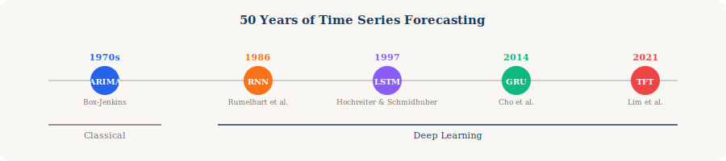
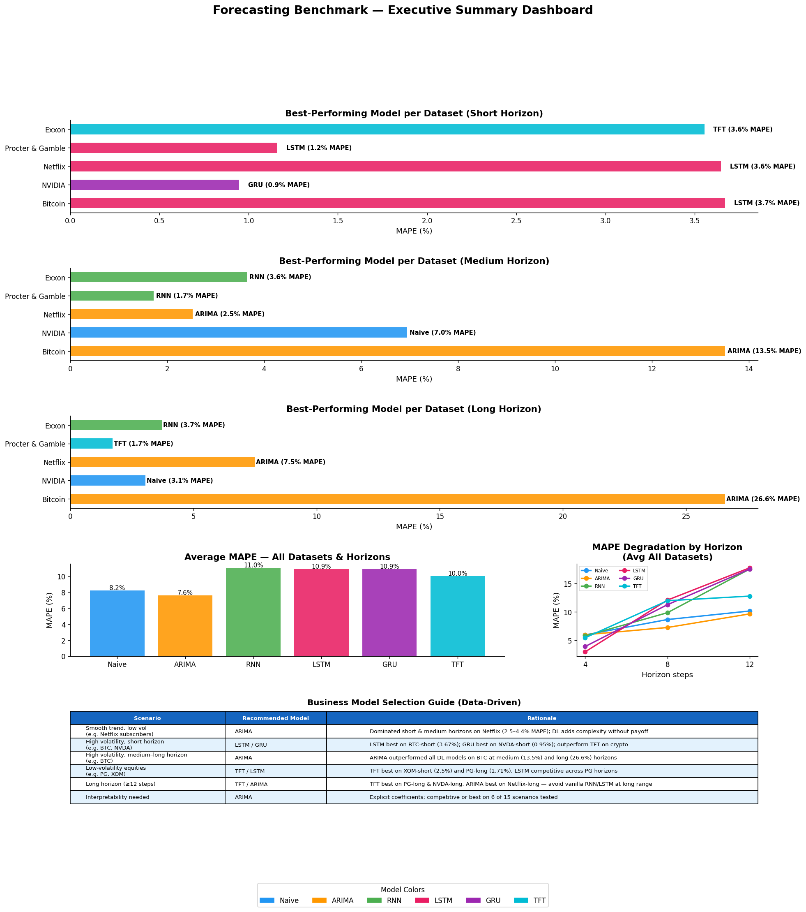
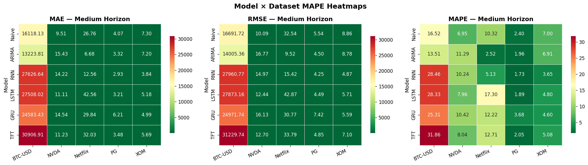
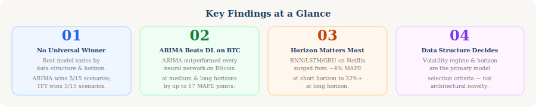

# A Multi-Domain Comparison with Pytorch Forecasting: RNN, LSTM, GRU & TFT

---

## Authors

| Name | GitHub |
|------|--------|
| *Nathan Brewer* | [`Gratedanate`](https://github.com/Gratedanate) |
| *Cade Haskins* | [`Cade26-code`](https://github.com/Cade26-code) |
| *Pratham Reddy* | [`PrathamReddy55`](https://github.com/PrathamReddy55) |
| *Morgan Wait* | [`morganwait`](https://github.com/morganwait) |

---

## Quick Links

| Resource | Link |
|----------|------|
| 📓 Notebook (Google Colab) | [`Project Code`](https://colab.research.google.com/drive/1HjXrNkBwUZ1UVd5D6W5q9e3ZMZ2iHhJk?usp=sharing) |
| 🌐 Interactive Web App | [`Stochastic Modeling with Pytorch Forecasting`](https://tp-2-pytorch-forecasting-team4.vercel.app/results) |
| 📊 Full Results CSV | [`docs/full_results.csv`](docs/full_results.csv) |

---

## Project Scope

> *Across time-series with fundamentally different structures — a smooth subscription growth curve (Netflix) and a volatile cross-sectional stock portfolio (NVIDIA, P&G, Exxon, Bitcoin) — how do deep learning sequence models (RNN, LSTM, GRU) and attention-based models (TFT) compare to classical statistical baselines (ARIMA, Naïve) in multi-step forecasting accuracy, and what does this reveal about model selection strategy for business forecasting?*

This project benchmarks **six forecasting models** across **five datasets** and **three forecast horizons** (90 total experiments) to produce data-driven, evidence-backed guidance for model selection in business and financial forecasting contexts.

---

## Project Details

### Models Evaluated

| Model | Year | Type | Key Property |
|-------|------|------|-------------|
| **Naïve** | — | Baseline | Repeats last observed value |
| **ARIMA** | 1970 | Classical Statistical | Linear, interpretable, best for stationary data |
| **RNN** | 1986 | Deep Learning | Sequential; suffers vanishing gradient |
| **LSTM** | 1997 | Deep Learning | Solves vanishing gradient via cell state + 3 gates |
| **GRU** | 2014 | Deep Learning | Simplified LSTM with 2 gates; fewer parameters |
| **TFT** | 2021 | Transformer | Attention-based; multi-horizon; quantile outputs |

*For more information about model histories, definitions, and pros and cons, [`click here`](docs/model_history_definitions_proscons.md).*

### Datasets

| Dataset | Type | Period | Frequency | Regime |
|---------|------|--------|-----------|--------|
| **Netflix Subscribers** | Subscription growth | 2013–2024 | Quarterly | Smooth, trend-dominant |
| **NVDA (NVIDIA)** | Equity | 2015–2025 | Weekly | High-growth, momentum-driven |
| **PG (Procter & Gamble)** | Equity | 2015–2025 | Weekly | Low volatility, defensive |
| **XOM (Exxon)** | Equity | 2015–2025 | Weekly | Macro-driven, cyclical |
| **BTC-USD (Bitcoin)** | Cryptocurrency | 2015–2025 | Weekly | Extreme volatility |

### Evaluation Metrics

- **MAE** (Mean Absolute Error) — average error in original units
- **RMSE** (Root Mean Squared Error) — penalizes large errors more heavily
- **MAPE** (Mean Absolute Percentage Error) — error as % of actual; primary cross-dataset metric

### Forecast Horizons

- **Short:** 4 steps ahead
- **Medium:** 8 steps ahead
- **Long:** 12 steps ahead

---

## Results Summary

### Key Findings

1. **No single model dominates universally.** ARIMA remains highly competitive on smooth, low-volatility series (Netflix subscriber growth), while deep learning models — especially LSTM and GRU — show advantages on volatile series at short horizons. Notably, ARIMA outperformed all deep learning models on BTC at medium and long horizons, challenging the assumption that neural architectures are superior on high-volatility data.

2. **Horizon matters more than model choice.** Across all methods, MAPE degrades sharply beyond 8 steps. This suggests that for long-horizon business planning, *ensemble strategies* or interval forecasts (e.g., TFT quantiles) are preferable to any single point estimate.

3. **TFT's advantages are most evident on stable, low-volatility series.** TFT achieved its best results on PG (long: 1.71% MAPE) and XOM (short: 2.51% MAPE), but was the worst-performing model on BTC across all horizons (short: 17.37%, long: 42.92%). The added architectural complexity does not reliably translate to accuracy gains on high-volatility or short univariate series.

4. **RNN underperforms consistently.** Vanilla RNN is dominated by both LSTM and GRU across all experiments, confirming that gated architectures effectively solve the vanishing gradient limitation. RNN should generally be avoided in production.

5. **Data structure is the primary model selection criterion.** Practitioners should assess series *volatility*, *length*, and *available covariates* before selecting a model — not default to deep learning due to novelty.

*For more information about future developments and concerns, [`click here`](docs/future_developments_concerns.md).*

*For more information about responsible AI considerations, [`click here`](docs/responsible_ai_considerations.md).*

---

## Why This Matters for Business

Forecasting is one of the most consequential tasks in modern business. Accurate forecasts help firms optimize inventory, hedge financial exposure, plan infrastructure, and allocate capital efficiently. When forecasts fail, those costs compound across every downstream decision.

Despite decades of innovation — from ARIMA in the 1970s to Transformer-based models in 2021 — no single model has proven universally superior. Practitioners frequently default to the most architecturally complex model available, assuming novelty equals accuracy. This study tests that assumption empirically across structurally different real-world datasets.

The business stakes are real: a model with 30% MAPE at a long horizon is not just academically imprecise — it is operationally dangerous if used to inform staffing, pricing, or capital allocation decisions without appropriate uncertainty disclosure.

---

## References

1. Ansari, A. F., Stella, L., Turkmen, C., Zhang, X., Mercado, P., Shen, H., Shchur, O., Rangapuram, S. S., Arango, S. P., Kapoor, S., Zschiegner, J., Maddix, D. C., Mahoney, M. W., Torkkola, K., Gordon Wilson, A., Bohlke-Schneider, M., & Wang, Y. (2024). Chronos: Learning the language of time series. *arXiv*. https://arxiv.org/abs/2403.07815

2. Boubakari, A., & Jin, D. (2010). The role of stock market development in economic growth: Evidence from some Euronext countries. *International Journal of Financial Research, 1*(1), 14–20. https://doi.org/10.5430/ijfr.v1n1p14

3. Box, G. E. P., & Jenkins, G. M. (1970). *Time series analysis: Forecasting and control*. Holden-Day.

4. Cho, K., van Merriënboer, B., Gulcehre, C., Bahdanau, D., Bougares, F., Schwenk, H., & Bengio, Y. (2014). Learning phrase representations using RNN encoder-decoder for statistical machine translation. In *Proceedings of the 2014 Conference on Empirical Methods in Natural Language Processing* (pp. 1724–1734). https://doi.org/10.3115/v1/D14-1179

5. Das, A., Kong, W., Leach, A., Mathur, S., Sen, R., & Yu, R. (2024). Long-term forecasting with TiDE: Time-series dense encoder. *arXiv*. https://arxiv.org/abs/2304.08424

6. Dietvorst, B. J., Logg, J. M., & Logg, J. (2015). Algorithm aversion: People erroneously avoid algorithms after seeing them err. *Journal of Experimental Psychology: General, 144*(1), 114–126. https://doi.org/10.1037/xge0000033

7. European Parliament. (2024). *Regulation (EU) 2024/1689 laying down harmonised rules on artificial intelligence (Artificial Intelligence Act)*. https://eur-lex.europa.eu/legal-content/EN/TXT/?uri=OJ:L_202401689

8. Floridi, L., Cowls, J., Beltrametti, M., Chatila, R., Chazerand, P., Dignum, V., & Lukowicz, P. (2019). An ethical framework for a good AI society. *Minds and Machines, 29*(4), 689–707. https://doi.org/10.1007/s11023-019-09797-8

9. Hochreiter, S., & Schmidhuber, J. (1997). Long short-term memory. *Neural Computation, 9*(8), 1735–1780. https://doi.org/10.1162/neco.1997.9.8.1735

10. Jin, M., Wang, S., Ma, L., Chu, Z., Zhang, J. Y., Shi, X., Chen, P., Lim, B., Yuan, B., Chu, Z., & Pan, S. (2024). Time-LLM: Time series forecasting by reprogramming large language models. *arXiv*. https://arxiv.org/abs/2310.01728

11. Lim, B., Arık, S. Ö., Loeff, N., & Pfister, T. (2021). Temporal Fusion Transformers for interpretable multi-horizon time series forecasting. *International Journal of Forecasting, 37*(4), 1748–1764. https://doi.org/10.1016/j.ijforecast.2021.03.012

12. Makridakis, S., Spiliotis, E., & Assimakopoulos, V. (2020). The M4 competition: 100,000 time series and 61 forecasting methods. *International Journal of Forecasting, 36*(1), 54–74. https://doi.org/10.1016/j.ijforecast.2019.04.014

13. Rahimikia, E., Ni, H., & Wang, W. (2025). Re(Visiting) time series foundation models in finance. *arXiv*. https://arxiv.org/abs/2511.18578

14. Rumelhart, D. E., Hinton, G. E., & Williams, R. J. (1986). Learning representations by back-propagating errors. *Nature, 323*(6088), 533–536. https://doi.org/10.1038/323533a0

15. Sako, K., Mpinda, B. N., & Rodrigues, P. C. (2022). Neural networks for financial time series forecasting. *Entropy, 24*(5), Article 657. https://doi.org/10.3390/e24050657

16. Vaswani, A., Shazeer, N., Parmar, N., Uszkoreit, J., Jones, L., Gomez, A. N., Kaiser, Ł., & Polosukhin, I. (2017). Attention is all you need. In *Advances in Neural Information Processing Systems 30* (pp. 5998–6008). https://arxiv.org/abs/1706.03762

17. Woo, G., Liu, C., Kumar, A., Xiong, C., Salehi, S., & Sahoo, D. (2024). Unified training of universal time series forecasting transformers. *arXiv*. https://arxiv.org/abs/2402.02592

18. Zhang, C., Amir Sjarif, N. N., & Ibrahim, R. (2024). Deep learning models for price forecasting of financial time series. *WIREs Data Mining and Knowledge Discovery, 14*(1), Article e1519. https://doi.org/10.1002/widm.1519

### Technical Documentation

19. PyTorch Forecasting. (n.d.). *PyTorch Forecasting documentation*.
    https://pytorch-forecasting.readthedocs.io/en/stable/models.html

20. Pattanayak, S. (2023). *Building RNN, LSTM and GRU for time series using PyTorch*. Towards Data Science. https://towardsdatascience.com/building-rnn-lstm-and-gru-for-time-series-using-pytorch-a46e5b094e7b

21. GeeksforGeeks. (2024). *RNN vs LSTM vs GRU vs Transformers*. https://www.geeksforgeeks.org/deep-learning/rnn-vs-lstm-vs-gru-vs-transformers/

---

*All stock data sourced from Yahoo Finance via `yfinance`. Netflix subscriber data sourced from [jagelves.github.io](https://jagelves.github.io/Data/Netflix.csv). Notebook authored for academic benchmarking purposes.*
